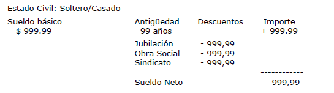

# Repositorio algoritmia

Repositorio general para almacenar los ejercicios de los diferentes tps

## Consignas

### TP2

- Ejercicio 7: Una persona invierte su capital en un banco y desea saber cuánto dinero ganará
en un mes, teniendo en cuenta que el banco paga 2% mensual. ¿Cuánto ganará
en seis meses si deja su dinero invertido?

- Ejercicio 8: Leer una medida en metros e imprimir esta medida expresada en centímetros,
pulgadas, pies y yardas. Los factores de conversión son:

    - 1 pie = 12 pulgadas

    - 1 yarda = 3 pies

    - 1 pulgada = 2,54 cm.

    - 1 metro = 100 cm.

- Ejercicio 9: Una inmobiliaria paga a sus vendedores un salario de $250000, más una comisión
de $50000 por cada venta realizada, más el 5% del valor de las ventas.
Realizar un programa que imprima el número del vendedor y el salario que le
corresponde en un determinado mes. Se leen el número del vendedor, la cantidad
de ventas que realizó y el valor total de las mismas.

- Ejercicio 10: Un productor agrícola desea estimar cuántos quintales de trigo puede producir
en su parcela. Escribir un programa para ingresar el largo y el ancho en metros
de la misma y determinar el rinde sabiendo que en 10 m2 se obtienen 2 quintales.

- Ejercicio 11: Leer un período en segundos e imprimirlo expresado en días, horas, minutos y
segundos. Por ejemplo, 200000 segundos equivalen a 2 días, 7 horas, 33 minutos
y 20 segundos.

- Ejercicio 12: Un banco necesita para sus cajeros automáticos un programa que lea una
cantidad de dinero e imprima a cuántos billetes equivale, considerando que
existen billetes de $1000, $500, $100, $50, $10, $5 y $1. Desarrollar dicho
programa de tal forma que se minimice la cantidad de billetes entregados por el
cajero.

- Ejercicio 13: Escribir un programa para convertir un número binario de 4 cifras en un número
decimal. El número binario se ingresa como un solo número entero de cuatro
dígitos.
Procedimiento: Para convertir un número binario a decimal es necesario
multiplicar el valor de cada dígito por el número 2 elevado a un exponente. Este
exponente se obtiene de la posición que ocupa el dígito dentro del número,
comenzando desde la derecha con la posición 0. Todos estos resultados se
suman para obtener el valor final. Ejemplo: Convertir 1011 a decimal:

13 02 11 10 = 1 * 23 + 0 * 22 + 1 * 21 + 1 * 20 = 11

### TP3

- Ejercicio 1: Ingresar dos números enteros e indicar si son iguales o distintos.

- Ejercicio 2: Leer un número entero e imprimir un mensaje indicando si es par o impar.

- Ejercicio 3: Desarrollar un programa que solicite un número de mes (por ejemplo 4) y
escriba el nombre del mes en letras ("abril"). Verificar que el mes sea válido y
mostrar un mensaje de error en caso de que no lo sea.

- Ejercicio 4: En el congreso se vota una ley muy importante. Desarrollar un programa que
permita ingresar la cantidad de votos a favor y en contra, e informe el porcentaje
obtenido en cada caso y si la misma fue aprobada o no.

- Ejercicio 5: Ingresar las notas de los dos parciales de un alumno e indicar si promocionó,
aprobó o si debe recuperar. Informar un error si el valor de alguna nota no está
entre 0 y 10.
    · Se promociona cuando las notas de ambos parciales son mayores o iguales a 7.
    · Se aprueba cuando las notas de ambos parciales son mayores o iguales a 4.
    · Se debe recuperar cuando al menos una de las dos notas es menor a 4.

- Ejercicio 6: Una editorial determina el precio de un libro según la cantidad de páginas que contiene. El costo básico del libro es de $5000, más $32 por página con encuadernación
rústica. Si el número de páginas supera las 300 la encuadernación debe ser en tela, lo que incrementa el costo en $1200. Además, si el número de
páginas sobrepasa las 600 se hace necesario un procedimiento especial de encuadernación que incrementa el costo en otros $3360. Desarrollar un programa
que calcule el costo de un libro dado el número de páginas.

- Ejercicio 7: Un fletero requiere un programa que calcule el precio de sus viajes a partir de la
cantidad de kilómetros que recorre. Para eso cuenta con la siguiente tarifa:
    · Viaje mínimo $2700. Sólo se cobra cuando el importe por kilómetro no alcanza este mínimo.
    · Si recorre entre 0 y 10 km: $400 por km
    · Si recorre 10 km o más: $200 por km

- Ejercicio 8: Leer un número correspondiente a un año e imprimir un mensaje indicando si es bisiesto o no. Un año es bisiesto cuando es divisible por 4. Sin embargo, aquellos años que sean divisibles por 4 y también por 100 no son bisiestos, a menos que también sean divisibles por 400. Por ejemplo, 1900 no fue bisiesto pero sí el 2000.

- Ejercicio 9: Leer tres números correspondientes al día, mes y año de una fecha e imprimir
un mensaje indicando si la fecha es válida o no.

- Ejercicio 10: Diseñar un programa que calcule y muestre el sueldo neto de un empleado en
base a su sueldo básico y su antigüedad en años. Si es soltero se le incrementa
el sueldo en 5% del salario bruto por cada año de antigüedad, mientras que si es
casado se le incrementa el sueldo en 7% del bruto por cada año de antigüedad.
También se le realizan los siguientes descuentos: Jubilación: 11%, Obra Social:
3%, Sindicato: 3%

    Como datos de entrada se ingresa por teclado el sueldo básico, antigüedad y
    estado civil (1 si es soltero o 2 si es casado). Se debe informar: (reemplazar los
    9 por los valores que correspondan)

### TP4

- Ejercicio 1: Realizar un programa para ingresar desde el teclado un conjunto de números. Al
finalizar mostrar por pantalla el primer y último valor ingresado. Finalizar la lectura
con -1.

- Ejercicio 2: Realizar un programa para ingresar desde el teclado un conjunto de números e
informar si la cantidad de elementos es impar o par, sin utilizar contadores. Finalizar
la lectura de datos con -1.

- Ejercicio 3: Realizar un programa para ingresar desde el teclado un conjunto de números y
mostrar por pantalla el menor y el mayor de ellos. Finalizar la lectura de datos
con un valor -1.

- Ejercicio 4: Desarrollar un programa que imprima la suma de los números impares comprendidos
entre 42 y 176.

- Ejercicio 5: Desarrollar un programa que imprima los números naturales comprendidos entre
1 y N. El valor de N se ingresa desde el teclado.

- Ejercicio 6: Mostrar la tabla de multiplicar (entre 1 y 12) del número 4. ¿Cómo cambiaría el
algoritmo para que el usuario pueda decidir la tabla de multiplicar a mostrar?

- Ejercicio 7: Leer 10 números enteros e imprimir su promedio, el mayor valor leído y en qué
posición se encontraba. Si se ingresó más de una vez sólo debe informar la primera.

- Ejercicio 8: Ingresar números, hasta que la suma de los números pares supere 100. Mostrar
cuántos números se ingresaron en total.

- Ejercicio 9: Se desea analizar cuántos autos circulan con patente con numeración par y
cuántos con numeración impar en un día. Escribir un programa que permita ingresar
la terminación de la patente (entre 0 y 9) hasta ingresar -1 e informe
cuántos vehículos pasaron con numeración par y cuántos con numeración impar.

- Ejercicio 10: El factorial de un número entero N mayor que cero se define como el producto
de todos los enteros X tales que 0 < X <= N. Desarrollar un programa para calcular
el factorial de un número dado. Deberán rechazarse las entradas inválidas
(menores que 0).

- Ejercicio 11: Realizar un programa que lea un número natural H e imprima un mensaje indicando
si H es primo o no. Se dice que un número es primo cuando sólo es divisible
por sí mismo y por la unidad.

- Ejercicio 12: La sucesión de Fibonacci es una sucesión de números enteros donde cada término
se obtiene como suma de los dos anteriores, siendo los dos primeros 0 y 1.
Por lo tanto, Fib=0, 1, 1, 2, 3, 5, 8, 13, 21.... Realizar un programa que lea N e
imprima los N primeros términos de esta sucesión, como así también la suma de
los mismos.
